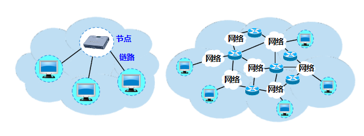
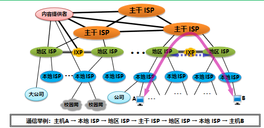
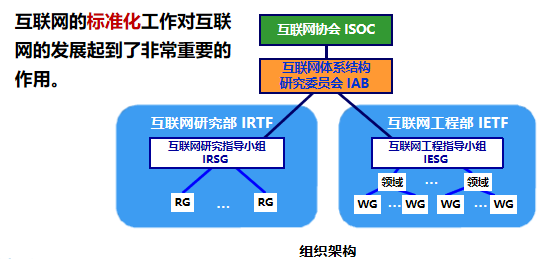

# 互联网概述
## 网络与互联网

计算机网络：由若干节点(node)和连接这些节点的链路(link)组成。节点可以是计算机、集线器、交换机或路由器等。

互连网：多个网络通过一些路由器相互连接起来，构成了一个覆盖范围更大的计算机网络。“网络的网络”(network of networks)。

**网络：把许多计算机连接在一起。**

**互连网：把许多网络通过一些路由器连接在一起。与网络相连的计算机常称为主机。**

**互连网 (internet) ≠ 互联网 (Internet)**

 
 

## 四个阶段

**第一阶段**

ARPANET：最初只是一个单个的分组交换网，不是一个互连网。
1983 年，TCP/IP 协议成为 ARPANET 上的标准协议，使得所有使用 		TCP/IP 协议的计算机都能利用互连网相互通信。
人们把 1983 年作为互联网的诞生时间。
1990 年，ARPANET 正式宣布关闭

**第二阶段**

三级结构：主干网、地区网和校园网（或企业网）

**第三阶段**

出现了**互联网服务提供者 ISP** (Internet Service Provider)：提供接入到互联网的服务。需要收取一定的费用。

多层次 ISP 结构：主干 ISP、地区 ISP 和本地 ISP

 **互联网交换点 IXP** (Internet eXchange Point)：允许两个网络直接相连并快速交换分组，常采用工作在数据链路层的网络交换机

**内容提供者** (Content Provider)：在互联网上向所有用户提供视频等内容的公司。不向用户提供互联网的转接服务

  

## 互联网的标准化工作

 
 

# 互联网组成
## 互联网的边缘部分
由所有连接在互联网上的主机组成，由用户直接使用，用来进行通信（传送数据、音频或视频）和资源共享 
处在互联网边缘部分的就是连接在互联网上的所有的主机。这些主机又称为端系统 (end system) 
端系统的拥有者：可以是个人、单位、或某个 ISP。

### 客户-服务器方式
客户是服务请求方，服务器是服务提供方。指的是计算机进程
### 对等连接方式
p2p并不区分哪一个是服务请求方和服务提供方，每一台主机既是客户端也是服务器

## 互联网的核心部分
由大量网络和连接这些网络的路由器组成，为边缘部分提供服务（提供连通性和交换）
 
+ 路由器(router):实现分组交换的关键构建，其任务是***转发收到的分组***

 
互联网的核心部分采用分组交换技术
